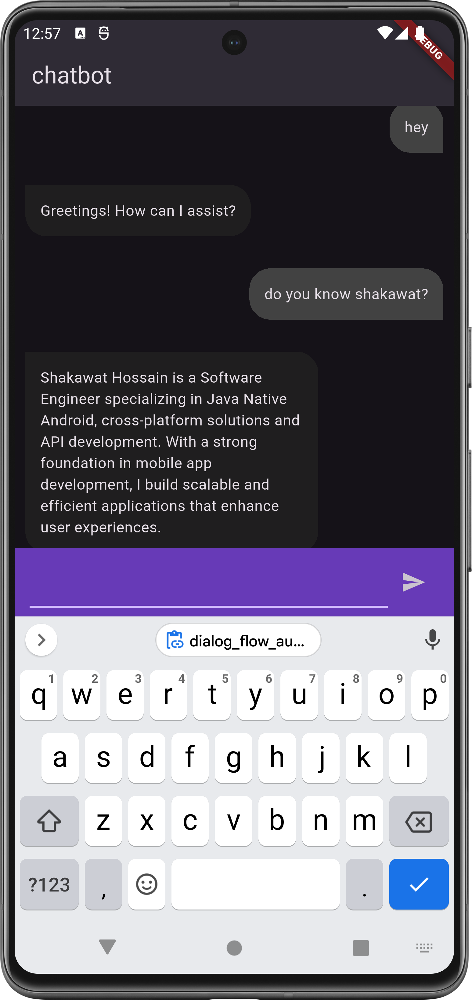

```markdown
# Flutter Chatbot with Dialogflow Integration

A Flutter-based chatbot application integrated with Google's Dialogflow for natural language processing. Users can interact with the chatbot, which responds intelligently based on predefined intents and training phrases configured in Dialogflow.

## Overview
This project demonstrates how to integrate Dialogflow (a natural language understanding platform) into a Flutter app to create a conversational chatbot. Dialogflow handles the backend NLP logic, while Flutter provides a smooth cross-platform UI.

## Prerequisites
- Flutter SDK installed (v3.0.0 or higher)
- Dart (v2.17.0 or higher)
- Google Cloud Account (for Dialogflow and Service Account setup)
- Basic knowledge of Flutter and Dart
- Dialogflow Agent setup (see [Setup Steps](#setup-dialogflow))

## Features
- Real-time chat interface
- Integration with Dialogflow for intent detection
- Easy configuration using service account credentials
- Customizable UI components
- Support for text-based interactions
```


## Installation
1. **Clone the repository**
   ```bash
   git clone https://github.com/theshakawat/dialogflow_chatbot_flutter.git
   cd dialogflow_chatbot_flutter
   ```

2. **Install dependencies**
   ```bash
   flutter pub get
   ```

## Setup Dialogflow
### Step 1: Create a Dialogflow Agent
1. Go to [Dialogflow Console](https://dialogflow.cloud.google.com).
2. Create a new agent (e.g., `MyChatbotAgent`).
3. Navigate to **Intents** and create intents with training phrases and responses.
   Example Intent:
    - **Intent Name**: `Welcome`
    - **Training Phrases**: "Hi", "Hello", "Hey there"
    - **Response**: "Hello! How can I assist you today?"

### Step 2: Set Up Service Account
1. Go to [Google Cloud Console](https://console.cloud.google.com).
2. Select your project linked to Dialogflow.
3. Navigate to **IAM & Admin > Service Accounts**.
4. Create a new service account (e.g., `dialogflow-chatbot-service`).
5. Assign the role **Dialogflow API Client**.
6. Under the service account, go to **Keys > Add Key > Create New Key**.
7. Choose **JSON** format and download the key file.

### Step 3: Add Credentials to Flutter Project
1. Place the downloaded JSON file in your project’s `assets` folder.
2. Update `pubspec.yaml` to include the asset:
   ```yaml
   assets:
     - assets/your-service-account-key.json
   ```

## Run the App
```bash
flutter run
```

## Customization
- **UI**: Modify `messages.dart` to change colors, fonts, or layout.
- **Intents**: Add more intents in Dialogflow Console for richer interactions.

## Important Notes
- Ensure the Dialogflow API is enabled in [Google Cloud Console](https://console.cloud.google.com/apis/library/dialogflow.googleapis.com).
- Keep your service account key secure. Avoid exposing it in public repositories.

## Troubleshooting
- **Missing Dependencies**: Run `flutter pub get` to resolve.
- **Authentication Errors**: Verify the JSON file path and project ID.
- **No Responses**: Check if the Dialogflow API is enabled and intents are properly trained.

## Contributing
Pull requests are welcome! For major changes, open an issue first.

## License
[MIT](https://choosealicense.com/licenses/mit/)

---

**Acknowledgments**:
- Dialogflow by Google
- Flutter Community

### Screenshot


Replace placeholders (e.g., `your-service-account-key.json`, `your-dialogflow-project-id`) with your actual values. Let me know if you need further adjustments! 🤖✨